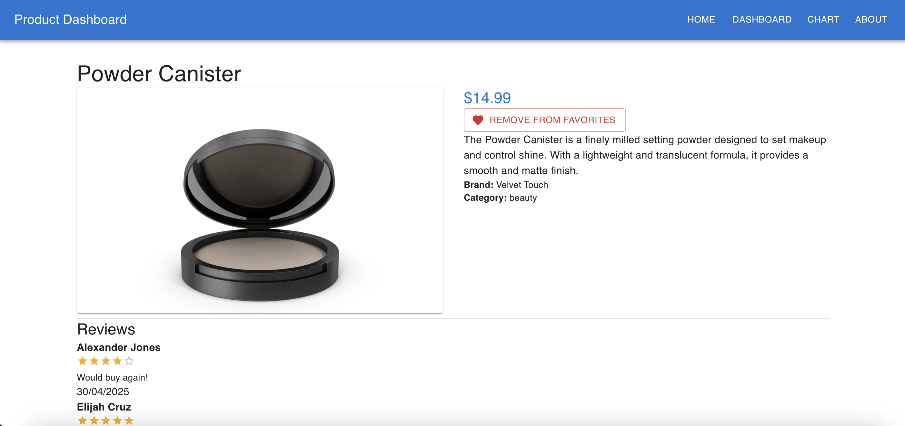
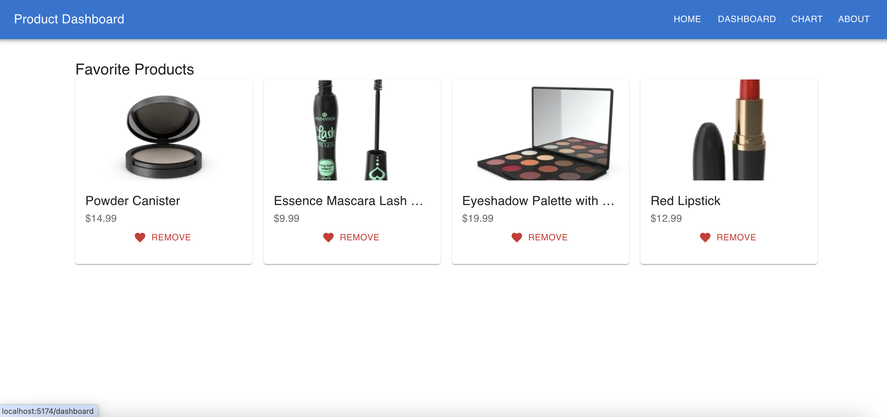
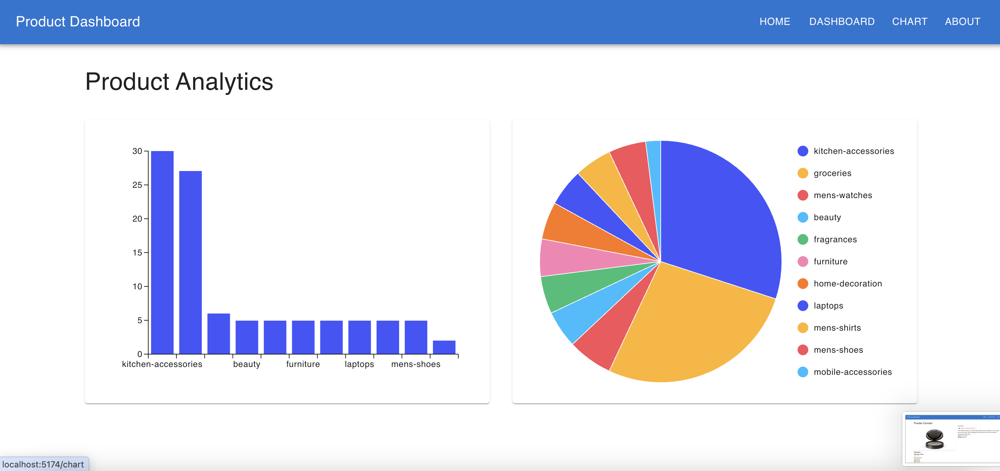

Product Dashboard

A modern React + TypeScript Product Dashboard built with scalable architecture and professional frontend practices.

🌍 Live Demo : https://react-product-dashboard-demo-g3xec7tvx.vercel.app/

Features
  - Product Search
  - Category Filtering
  - Pagination
  - Favorites Product
  - Product Detail Page
  - Reviews with Ratings
  - Data Visualization

Application Pages
  - Home
  - Browse products with:
    - Search
    - Category filter
    - Pagination
  - Dashboard
  - Product Detail
  - Chart
  - About

⚙️ Installation

Clone the repository:

git clone https://github.com/debasishm/react-product-dashboard/tree/develop

Navigate into the project:

cd product-dashboard

Install dependencies:

npm install

Run development server:

npm run dev

## 📸 Screenshots

### Home Page

### Product Detail

### Dashboard

### Chart

